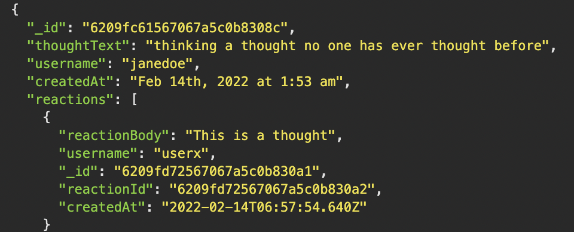

# Social Network Api
  
   

  
  
   
  
       
   

  ## TABLE OF CONTENTS

  ---

  [Description](#description) *
  [Installation](#installation) *
  [Usage](#usage) *
  [Contributions](#contributions) *
  [Questions](#questions) *
  [License](#license)

   

    
  
   

  ## Description

  ---

  This is an api for a social network app that allows you to create/update/destroy a user, add/remove friends, create/destroy thoughts and reactions.
   
   
  Repo: (https://github.com/sihayah/social-network-api)

  

  ## Installation

  ---
  
  Download the repo locally, navigate to the repo in VsCode. In an integrated terminal, run npm install.

   

## Usage

  ---

  https://watch.screencastify.com/v/y1LgicveNaKpByl8oQlw

   

  ## Contributions

  ---

  To contribute, submit a pull request with information about any updates or bug fixes.

 

   

  ## Questions

  ---

  For any further inquiries, please contact me via gitHub: [(sihayah)](https://github.com/sihayah) or email: sihayaharris@gmail.com

   

  

  ## License

  ---
  
  [click here for more information about  license.](https://opensource.org/licenses/ISC)
  

   
   
